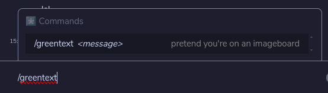
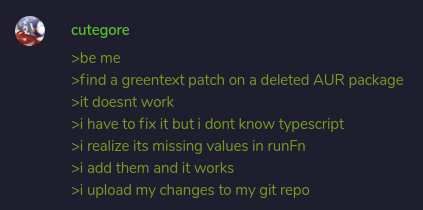

A collection of various patches I've created or modified for the Element client.
For now there's only a greentext patch.





## Instructions
1. `git clone https://github.com/element-hq/element-web.git`
2. `cd element-web`
3. `yarn install`
4. `git clone https://git.supernets.org/nameless/element-web-patches`
7. `patch node_modules/matrix-react-sdk/src/SlashCommands.tsx element-web-patches/greentext.patch`
8. `yarn dist`

## Nix
You can automatically apply this patch to Element Desktop on Nix with the use of an overlay.
```nix
self: super:
{
  element-web = super.element-web.overrideAttrs (oldAttrs: rec {
    greentext = super.fetchpatch {
	  url = "https://git.supernets.org/nameless/element-web-patches/raw/branch/main/greentext.patch";
      sha256 = ""; # Replace this with the hash provided by Nix.
    };
    configurePhase = oldAttrs.configurePhase + ''
      patch node_modules/matrix-react-sdk/src/SlashCommands.tsx ${greentext}
    '';
  });
}
```

Credits to [Ren Tatsumoto](https://github.com/tatsumoto-ren) for the original greentext patch.
